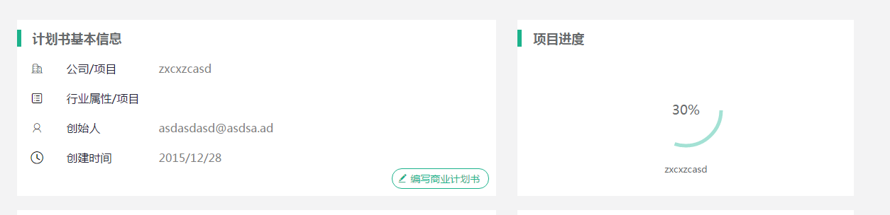

## state与props
props->dom.attributes,即标签属性    
state->model,即与视图进行沟通的model,如checkbox.checked,通过setState的方式,动态进行修改,可通过props的方式初始化数据    
故所有可能动态修改的属性都需要status


## 组件与布局
布局,大概就是PM所掌握的最小UI单元,`做一个投标管理,上面是状态,下面是数据,其实跟招标管理长得一样,很简单的`,以上就是我某次收到的曹姓PM的需求描述,具体的属性,内容会根据用户需求随便修改,具体接口跟后台商量,但是整体风格就是`跟招标管理一样`,非常明确的描述....    
我会将PM看见的布局提出来,但我不想在使用布局是也用组合的方式,我喜欢用继承的方式(受EXT影响),这样我在命名是就可以使用`业务模型+布局`方式    
比如,`项目进度,跟计划书基本信息一样,上面显示项目进度的标题,里面显示一个进度条`

代码
```
// 某个PM看得见的布局
import React, { Component } from 'react';

export default class Panel  extends Component {
  constructor(props) {
      super(props);
      this.state={
        title:"标题",
        body:(<p>里面的那个</p>)
      }
  }
  render() {
    console.log(this.state)
    return (
      <div>
         <h3>{this.state.title}</h3>
           {this.state.body}
      </div>
    );
  }
};


//计划书基本信息
import React, { Component } from 'react';
import Panel from '../layout/Panel'
export default class BasePanel  extends Panel {
    constructor(props){
      super(props);
      this.state ={
        title:'计划书基本信息',
        body:(<BaseComponent />)
      };
    }
};


class BaseComponent extends Component{
  render(){
    return (<div>基本信息xxx</div>)
  }
}

//项目进度
import React, { Component } from 'react';
import Panel from '../layout/Panel'
export default class ProgressPanel  extends Panel {
    constructor(props){
      super(props);
      this.state ={
        title:'项目进度',
        body:(<div>进度条</div>)
      };
    }
};
```
继承布局主要继承render的结构,通过参数(state)的方式传递子组件


## css in js
`这个组件就一种颜色,不要让他老变`,`先点这个,在点这个,然后回去,看,这个按钮颜色就变了`我常听到PM/产品的一句话,其实就是css冲突,听到的越多,就越感觉,依赖选择器的方式与PM的冲突越来越大- -    
对于PM来说,这个布局/组件就是这种颜色,内部交互维护这种样式的修改,为什么会在加载其他组件/样式后,他的样式就变了呢-。-除了告诉他,选择器冲突这种他绝壁不在乎的词意外,还可以选择css-modules    
依然使用以下规则,描述组件使用less/sass的继承方式,开头一定用组件名,用以解决冲突,故,此处引用css-modules所做的事,就是将组件名加入hash值,用以杜绝组件名的冲突


## 使用mobx管理state
state就是vm,用以描述组件关注的数据,但其高度依赖组件本身,只能通过事件调用setState的方式进行修改,使用mobx将其提取出来,用以实现VM层
```javascript
//vm管理
import { observable } from 'mobx';

class BaseInfo {
  //监控属性,转为vm
  @observable name = "default";

  constructor(obj={}) {
    super(obj);
    this.name=obj.name;
  }

}


//组件管理
import React, { Component } from 'react';
import Panel from './Panel'
import styles from './Panel.css';  
import Button from '../Button'
import { observer } from 'mobx-react';

export default class PanelBase  extends Panel {
    constructor(props){
      super(props);
      this.state ={
        title:'计划书基本信息',
        body:(<BaseComponent  baseInfo={props.baseInfo}/>),
        ...props
      };
    }
};

//订阅相关mobx信息
@observer
class BaseComponent extends Component{
  render(){
    return (
          <div className={ styles.base }>
            <ul >
                <li><a className="glyphicon glyphicon-pencil"></a><label>公司/项目</label><span>{this.props.baseInfo.name}</span></li>
                <li><a className="glyphicon glyphicon-pencil"></a><label>行业属性/项目</label><span>12312</span></li>
                <li><a className="glyphicon glyphicon-pencil"></a><label>创始人</label><span>123</span></li>
                <li><a className="glyphicon glyphicon-pencil"></a><label>创建时间</label><span>123</span></li>
            </ul>
            <footer > 
            <Button onClick={this.click.bind(this)}><a  className="glyphicon glyphicon-pencil"></a>编写商业计划书</Button>
            </footer>
          </div>)
  }
  click(){
    var self=this;
    setTimeout(function(){
      //修改被监控的属性,将会在订阅组件中进行更新
      self.props.baseInfo.name=Math.random()
    },1000)
  }
}
```

## Model与VM
Model代表数据源,负责获取,维护,适配数据,其数据来源包括但不限于xhr,localStorage,sessionStorage甚至内存中自定义,一般为Ajax的封装,可以通过Builder工程进行自动维护    
VM为组件关心的属性,与Model有交集,大部分id系列并不需要VM,大部分组件状态(如checked),并不一定会在Model中描述    
简单来说,只有Model可与后台沟通(Ajax),VM与Model通过函数or属性交换的方式进行沟通    
本项目属于传统ERP项目,此处允许VM继承Model,用以获取save/load的方法进行快速开发,再次强调,此处高度耦合,需要额外的代码处理还原,新旧数据比较,个性新增等需求,遇见不适情况,自觉分割    

```javascript
//基础Model
export default  class Model  {

  load(){
    var get=this.proxy.get;
    if(!get)return;
    var self=this;
    fetch(get)
      .then(function(response) { 
          return response.json();  
      }).then(function(json) {  
        self.setData(json)
      });  
  }
  
  setData(data){
    Object.assign(this, data);
  }

}

//vm管理
import { observable } from 'mobx';
import Model from './Model'

class BaseInfo extends Model{
  proxy={
    get:"/json/person.json"
  }
  @observable name = "default";

  constructor(obj={}) {
    super(obj);
    this.name=obj.name;
  }

}

export default BaseInfo;

//组件
import React, { Component } from 'react';
import Panel from './Panel'
import styles from './Panel.css';  
import Button from '../Button'
import { observer } from 'mobx-react';


export default class PanelBase  extends Panel {
    constructor(props){
      super(props);
      this.state ={
        title:'计划书基本信息',
        body:(<BaseComponent  baseInfo={props.baseInfo}/>),
        ...props
      };

    }
};


@observer
class BaseComponent extends Component{
  render(){
    return (
          <div className={ styles.base }>
            <ul >
                <li><a className="glyphicon glyphicon-pencil"></a><label>公司/项目</label><span>{this.props.baseInfo.name}</span></li>
                <li><a className="glyphicon glyphicon-pencil"></a><label>行业属性/项目</label><span>12312</span></li>
                <li><a className="glyphicon glyphicon-pencil"></a><label>创始人</label><span>123</span></li>
                <li><a className="glyphicon glyphicon-pencil"></a><label>创建时间</label><span>123</span></li>
            </ul>
            <footer > 
            <Button onClick={this.click.bind(this)}><a  className="glyphicon glyphicon-pencil"></a>编写商业计划书</Button>
            </footer>
          </div>)
  }
  click(){
    var self=this;
    //继承模型后,vm可通过load的方式获取数据
    self.props.baseInfo.load()
  }
}
```

## VM包含Model
某些最小单元的组件,如Input,可使用双向绑定的方式进行关联(value),此时不再依赖click/change事件,vm与最终上传的model之间的关联依赖PM,比如通过添加按钮将vm的属性加入model中,故也可以使用组合的方式进行关联    


## 模块结构
以维护/展示的主业务作区分,其他模块做辅助(基础参照),组件属于模块私有,容器为共有
